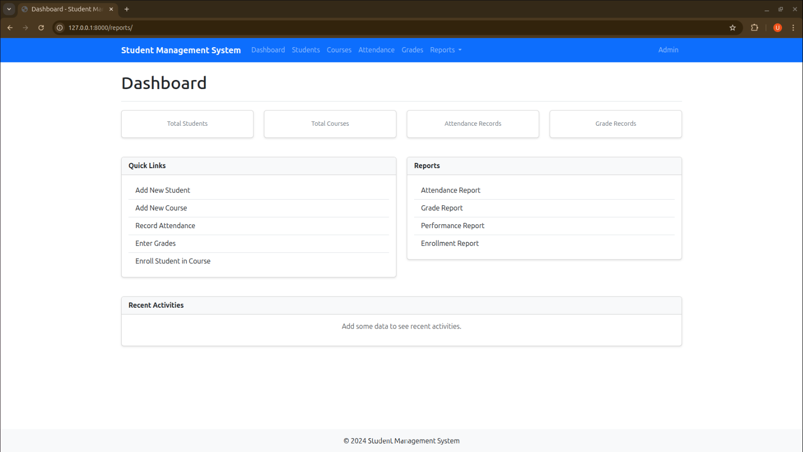

# Student Management System

A comprehensive Django-based Student Management System to manage students, courses, attendance, grades, and reports.

## Features

- **Student Management**: Add, update, delete, and view student information
- **Course Management**: Manage courses and assign teachers
- **Attendance Tracking**: Track student attendance for each course
- **Grade Management**: Record and manage student grades
- **Reports**: Generate various reports (attendance, grades, performance)

## Prerequisites

- Python 3.8+
- Django 4.x
- PostgreSQL or SQLite (default)

## Installation Steps

### Step 1: Create Virtual Environment
```bash
python -m venv venv
source venv/bin/activate  # On Windows: venv\Scripts\activate
```

### Step 2: Install Django
```bash
pip install django
```

### Step 3: Create Django Project
```bash
django-admin startproject student_management .
```

### Step 4: Create Django Apps
```bash
python manage.py startapp students
python manage.py startapp courses
python manage.py startapp attendance
python manage.py startapp grades
python manage.py startapp reports
```

### Step 5: Configure Settings
Add apps to `INSTALLED_APPS` in `student_management/settings.py`:
```python
INSTALLED_APPS = [
    'django.contrib.admin',
    'django.contrib.auth',
    'django.contrib.contenttypes',
    'django.contrib.sessions',
    'django.contrib.messages',
    'django.contrib.staticfiles',
    'students',
    'courses',
    'attendance',
    'grades',
    'reports',
]
```

### Step 6: Run Migrations
```bash
python manage.py makemigrations
python manage.py migrate
```

### Step 7: Create Superuser
```bash
python manage.py createsuperuser
```

### Step 8: Run Development Server
```bash
python manage.py runserver
```

Access the application at `http://127.0.0.1:8000/`

## Project Structure

```
student_management_system/
├── manage.py
├── student_management/
│   ├── __init__.py
│   ├── settings.py
│   ├── urls.py
│   └── wsgi.py
├── students/
│   ├── migrations/
│   ├── templates/students/
│   ├── admin.py
│   ├── models.py
│   ├── urls.py
│   └── views.py
├── courses/
│   ├── migrations/
│   ├── templates/courses/
│   ├── admin.py
│   ├── models.py
│   ├── urls.py
│   └── views.py
├── attendance/
│   ├── migrations/
│   ├── templates/attendance/
│   ├── admin.py
│   ├── models.py
│   ├── urls.py
│   └── views.py
├── grades/
│   ├── migrations/
│   ├── templates/grades/
│   ├── admin.py
│   ├── models.py
│   ├── urls.py
│   └── views.py
├── reports/
│   ├── migrations/
│   ├── templates/reports/
│   ├── admin.py
│   ├── models.py
│   ├── urls.py
│   └── views.py
├── templates/
│   └── base.html
└── static/
```

## Models

### Student (students app)
- `user` - OneToOneField to User model
- `student_id` - Unique identifier
- `first_name`, `last_name`
- `email`, `phone`
- `date_of_birth`
- `address`
- `enrollment_date`
- `program`

### Course (courses app)
- `course_code` - Unique identifier
- `name`
- `description`
- `credits`
- `teacher` - ForeignKey to User/Teacher
- `semester`
- `year`

### Enrollment (courses app)
- `student` - ForeignKey to Student
- `course` - ForeignKey to Course
- `enrollment_date`
- `status` (active, completed, dropped)

### Attendance (attendance app)
- `student` - ForeignKey to Student
- `course` - ForeignKey to Course
- `date`
- `status` (present, absent, late)
- `remarks`

### Grade (grades app)
- `student` - ForeignKey to Student
- `course` - ForeignKey to Course
- `assignment_score`
- `exam_score`
- `total_score`
- `grade` (A, B, C, D, F)
- `semester`

## URL Patterns

- `/` - Home/Dashboard
- `/students/` - Student list and management
- `/courses/` - Course list and management
- `/attendance/` - Attendance tracking
- `/grades/` - Grade management
- `/reports/` - Reports and analytics
- `/admin/` - Django admin interface

## Usage

1. Access Django admin at `/admin/` to create initial data
2. Navigate to different sections to manage students, courses, attendance, and grades
3. Generate reports from the reports section

## License

MIT License


